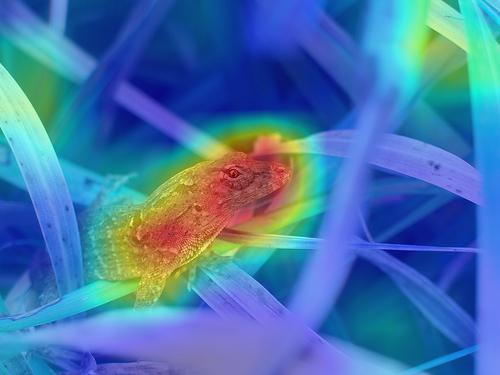

# Tiny-ImageClassification-Tools

This project implements the basic tools wisely used in image classification tasks, including  Grad-cam, counting Parameters and FLOPs.

## Highlights

**Very fast training speed:** The codebase has the very fast training speed by virtue of **NVIDIA-DALI** dataloader and automatic mixed precision. For example, the **ResNet-50** model is trained for 90 epochs within about ***7.5*** hours based on **a 8x3090 GPU server**.

**Concise:** the project is implemented by using as fews lines of codes as possible and is very concise and intuitive, it is very friendly to newcomers.

**Accurate:** the accuracy of the codebase can achieve the official implementation of PyTorch.

## Main libs
```
pytorch==1.9.1
torchvision==0.9.1
cuda==11.1
nvidia-dali-cuda110==1.16.0
```

## Training
download the ImageNet dataset (about 1.28M images in total. use ```valprep.sh``` script to split 50000 val images to 1000 subfolders if needed.) and set the hyper-parameters as follows:
```
# ================================================================================
#                                 All Settings
# ================================================================================
world_size = 8 # How many GPUs is used to DDP
net = "darknet53" # resnet50, darknet53...
imagenet_data_path = "./imagenet1000" # the train and val folders which has 1000 sub-folders should be in this path.
num_classes = 1000
train_crop_size = 224 # crop size of training
val_resize_size = 256 # resize size before crop of val
save_dir = "./weights"
start_epoch = 0
end_epoch = 90
total_batch_size = 1024 # total batchsize.
init_lr = total_batch_size*0.1/256 # lr
momentum = 0.9
weight_decay = 1e-4
optimizer = "SGD"
workers = 16 # per gpu workers
lr_step = [30,60] # lr*0.1 at each step
print_interval = 50

seed = 666 # random seed
warmup = True # warmup for first 5 epochs 
amp_use = True # pytorch automatic mixed precision
dali_loader = True # nvidia DALI dataloader
dali_cpu = True # whether to use cpu for DALI. For Large model, "True" is faster for training.
torch.backends.cudnn.benchmark = True
# ================================================================================
```
and then
```
python train.py
```

## Evaluation, visualizing grad-cam images, counting parameters and FLOPs, etc.
set the corresponding parameters in eval.py, gradcam_demo.py, count_Params_FLOPs.py, and then:
```
python eval.py
python gradcam_demo.py # the generated grad-cam maps is in gradcam_image folder.
python count_Params_FLOPs.py
python classifier_demo.py
```

## Grad-cam image example:
  

## Main results
Unless otherwise specified, all models here are trained with 90 epochs.
net  | training size  | test size | top-1 acc | link
 ---- | ----- | ------  | ----- | -----
ResNet-50 ([pytorch official](https://github.com/pytorch/examples/blob/main/imagenet/main.py))  | 224 | 224 | 75.88 |
ResNet-50  | 224 | 224 | 75.93 | [link](https://github.com/yanlongbinluck/Tiny-ImageClassification-Tools/releases/download/v1.0/resnet50_75.93.pth)
ResNet-50  | 224 | 256 | 76.82 |
darknet-53  | 224 | 224 | 76.28 | [link](https://github.com/yanlongbinluck/Tiny-ImageClassification-Tools/releases/download/v1.0/darknet53_76.28.pth)
darknet-53  | 224 | 256 | 77.11 |

## Acknowledgement
This project is mainly implemented based on [pytorch official imagenet](https://github.com/pytorch/examples/blob/main/imagenet/main.py), [NVIDIA-DALI](https://github.com/NVIDIA/DALI/blob/8b8e7c6521c4de78fb6774fdf3263d6ded47a6df/docs/examples/use_cases/pytorch/resnet50/main.py), [grad-cam](https://github.com/leftthomas/GradCAM), [thop](https://github.com/Lyken17/pytorch-OpCounter), etc. Many Thanks for these repos.
